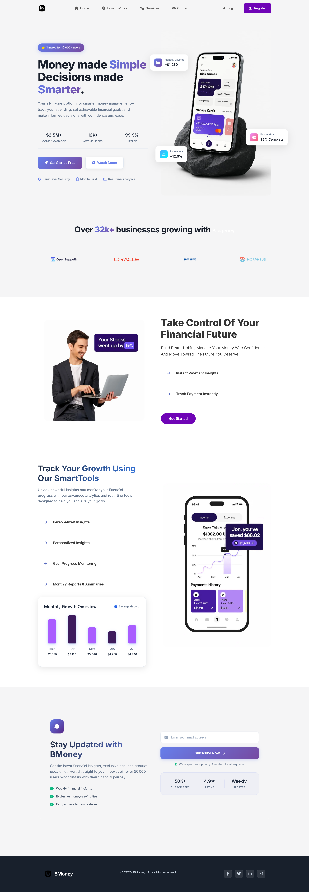

# Bmoney - Financial Services Platform

A modern, responsive financial website designed to deliver exceptional user experience for financial service management and presentation. Built with performance and accessibility in mind.

## Live Demo

**[View Live Site](https://bmney-website-smh9.vercel.app/)**

## Preview

## Key Features

- **Responsive Design**: Mobile-first approach ensuring optimal experience across all devices
- **Hero Section**: Compelling call-to-action with clear value proposition
- **Brand Showcase**: Trusted partners and client testimonials section
- **Financial Analytics**: Interactive tracking and benefits visualization
- **Performance Optimized**: Fast loading times with optimized assets
- **Modern UI/UX**: Clean, professional interface design

## Technology Stack

- **Frontend**: HTML5, CSS3
- **Styling**: Responsive Grid, Flexbox
- **Icons**: Font Awesome
- **Typography**: Google Fonts (Inter)
- **Deployment**: Vercel

## Getting Started

1. Clone the repository
2. Open `index.html` in your browser
3. For development, use a local server (e.g., Live Server extension)

## Browser Support

Supports all modern browsers including Chrome, Firefox, Safari, and Edge.
